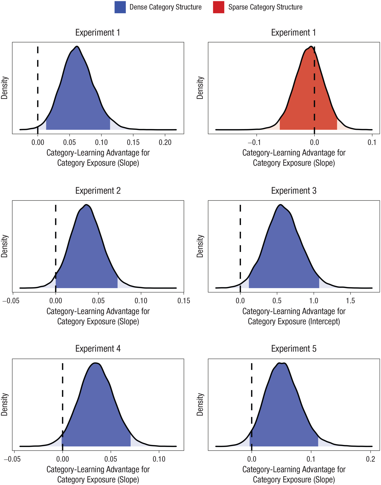

This project examined whether even passive, incidental exposure to new things helps people learn about them.

The full project is reported in Unger & Sloutsky (2022) Ready to Learn: Incidental Exposure Fosters Category Learning, *Psychological Science* <https://doi.org/10.1177/09567976211061470>

The focus of this project was on learning about *categories*. Categories like dog, cup, and chairare a fundamental building block of human knowledge that guide how we think about and interact with the world around us. Here, we wanted to understand whether even *incidental* experiences with categories (like passing a dog on the street or a cup on a table) contribute to building category knowledge.

This project involved a series of experiments in which people were exposed to some new, artificially-generated creatures that, *unbeknownst to them*, were divisible into categories (e.g., members of the two categories tended to have different-looking body parts). During initial exposure, we didn't mention categories at all - we just asked people to do a simple task while looking at the creatures, like saying whether a creature was on the right or left of the screen. A baseline control group of participants saw creatures that looked similar, but weren't divisible into categories.

Afterward, we explicitly prompted people to try to learn how to distinguish members of one category from the other. Our key question was whether the initial, incidental exposure helped people learn. We used Bayesian hierarchical analyses to contrast learning curves in people who got the incidental exposure to the control group, and found that yes, incidental exposure helped people learn the categories more rapidly.

This repository includes data, scripts and specifications for Bayesian hierarchical models (in [stan](https://mc-stan.org/rstan/)).

